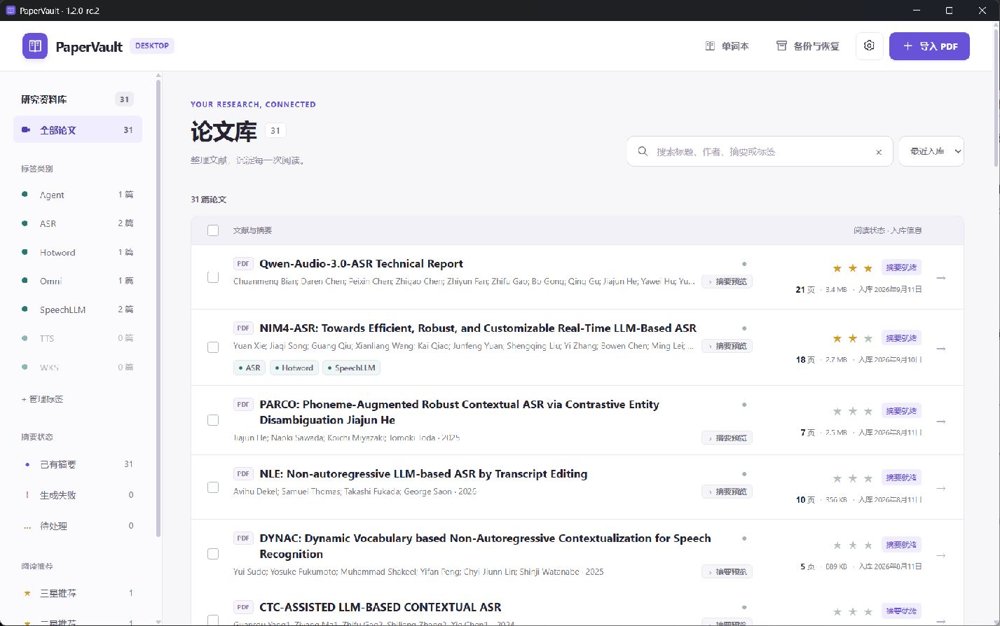

# PaperVault

**把论文读进去，把理解留下来。**

[下载桌面版](https://github.com/skywuxuan/PaperVault/releases/tag/v1.2.0-rc.2) · [快速开始](#快速开始) · [桌面版指南](docs/DESKTOP.md) · [版本记录](CHANGELOG.md)

[](https://github.com/skywuxuan/PaperVault/actions/workflows/windows-release.yml)


PaperVault 是一个本地优先的论文阅读与管理工具。把 PDF、双语摘要、阅读批注和自己的笔记放在一起，从收集资料、理解内容到整理观点，形成一套连续的阅读流程。

论文库保存在你的电脑上，无需注册账号，也不依赖云端数据库。Windows 桌面版、Apple Silicon Mac 桌面版与从源码启动的 Web 版共用同一套前端和后端。

## 下载桌面版

最新候选版为 **[v1.2.0-rc.2](https://github.com/skywuxuan/PaperVault/releases/tag/v1.2.0-rc.2)**。两个平台的程序都在同一个 [GitHub Releases 页面](https://github.com/skywuxuan/PaperVault/releases/)，不需要到 Actions 查找下载。

| 平台 | 下载 | 使用方式 |
| --- | --- | --- |
| Windows 10/11 x64 | [Windows 便携 ZIP](https://github.com/skywuxuan/PaperVault/releases/download/v1.2.0-rc.2/PaperVault-v1.2.0-rc.2-windows-x64.zip) | 完整解压后运行 `PaperVault\PaperVault.exe` |
| macOS 14+ · Apple Silicon（M 系列） | [macOS arm64 ZIP](https://github.com/skywuxuan/PaperVault/releases/download/v1.2.0-rc.2/PaperVault-v1.2.0-rc.2-macos-arm64.zip) | 解压后将 `PaperVault.app` 拖入“应用程序” |

本版标记为预发布；Windows 稳定版 [v1.1.0](https://github.com/skywuxuan/PaperVault/releases/tag/v1.1.0) 仍可下载。Windows ZIP 不会自动创建快捷方式，也不会出现在“已安装的应用”中；macOS 包使用 ad hoc 签名，尚未完成 Developer ID 签名与 Apple 公证。详见[安装、打开与卸载说明](docs/DESKTOP.md#安装与首次使用)。



*图为 v1.2.0-rc.1 界面，使用演示数据；v1.2.0-rc.2 已进一步精简列表与阅读器，具体变化见下文。*

## 最近更新

- **2026-09-16 · [v1.2.0-rc.2](https://github.com/skywuxuan/PaperVault/releases/tag/v1.2.0-rc.2)** — 收紧论文列表，固定摘要预览按钮的位置；使用“默认解析”和“豆包解析”直接切换内容，英文摘要单击选段、双击查词。Windows 与 Mac 下载放在同一发行页。[查看变更](CHANGELOG.md#120-rc2---2026-09-16)。
- **2026-09-15 · [v1.2.0-rc.1](https://github.com/skywuxuan/PaperVault/releases/tag/v1.2.0-rc.1)** — 更新论文库与阅读器设计，修复笔记保存、摘要任务恢复和资源包兼容性问题，加入 Apple Silicon Mac 桌面版。
- **2026-09-11 · [v1.1.0](https://github.com/skywuxuan/PaperVault/releases/tag/v1.1.0)** — 新增 `.pvault` 备份与恢复，把论文、PDF、摘要、笔记和单词本打包迁移。
- **2026-08-13 · [v1.0.0](https://github.com/skywuxuan/PaperVault/releases/tag/v1.0.0)** — 首个 Windows 桌面正式版，提供论文管理、双语摘要阅读和单词本。

## 从一篇 PDF 开始

### 收集与整理

一次导入一篇或多篇 PDF，自动识别标题、作者和年份。用标签、阅读状态和 0–3 星推荐度整理论文；通过关键词和筛选快速找到需要的内容。删除的论文先进入回收站，可以恢复。

### 对照阅读

在同一个阅读器中查看 PDF、英文摘要和中文摘要。摘要支持段落联动、同步滚动与原文页码定位；PDF 支持缩放、跳页、文本选择和高亮批注。

你也可以导入豆包公开分享页中的解析，保留标题、列表、表格和公式，并生成英文对照。阅读器顶部的“默认解析”和“豆包解析”分别展示两种内容；尚无内容时，对应按钮显示“生成摘要”或“导入豆包”。点击来源按钮只切换内容，不改变来源名称。

### 留下自己的理解

在独立笔记面板中记录想法，将 PDF 或摘要中的内容引用到笔记。英文摘要单击选择段落，双击单词查看释义与美式发音，并可加入单词本。论文摘要和元数据可导出为 Markdown 或 JSON。

### 备份与迁移

通过“备份与恢复”生成 `.pvault` 文件，将资料带到另一台电脑，或为当前论文库保留副本。

| 资源包 | 包含内容 | 适合场景 |
| --- | --- | --- |
| 标准资源包 | 数据库与全部原始 PDF | 日常备份、迁移论文库 |
| 离线完整包 | 标准资源包的内容，加上已有预览资产和离线翻译模型 | 连同已下载的离线资源一起迁移 |

两种资源包都会保留摘要、豆包解析、笔记、引用、批注、标签、评分、单词本、回收站和任务记录。模型 API Key、`.env.local`、WebView 缓存和临时文件不包含在资源包中。

恢复时会先校验文件路径、SHA-256 和数据库完整性，再自动备份当前库并替换数据。**当前版本仅支持完整替换，不支持合并两个论文库。** 资源包不包含程序本身；在新电脑上先安装 PaperVault，再导入资源包。

## 快速开始

### Windows 桌面版

适用于 Windows 10/11 x64，无需自行安装 Python。

1. 下载 [Windows v1.2.0-rc.2 便携包](https://github.com/skywuxuan/PaperVault/releases/download/v1.2.0-rc.2/PaperVault-v1.2.0-rc.2-windows-x64.zip)。
2. 完整解压到固定目录，保留 `PaperVault.exe` 旁的 `_internal` 等全部文件和目录；不要直接在 ZIP 内运行。
3. 打开 `PaperVault\PaperVault.exe`，点击“导入 PDF”开始使用。

以后从同一位置运行 `PaperVault.exe`。可以右键该文件，选择“显示更多选项 → 发送到 → 桌面快捷方式”；Windows 10 可直接选择“发送到”。**这是便携版，不是安装器**，不会自动加入开始菜单，也不会出现在“设置 → 应用 → 已安装的应用”中。

卸载时先退出程序，再删除解压的程序文件夹和自行创建的快捷方式。论文库另存于 `%LOCALAPPDATA%\PaperVault`；保留这个目录即可保留论文、笔记与设置。桌面版依赖 Microsoft Edge WebView2 Runtime，系统缺少时需先安装该组件。

### macOS 桌面版

适用于 macOS 14 或更高版本、Apple Silicon（M 系列）Mac，使用系统 WKWebView，无需另行安装 Python 或 WebView2。Intel Mac 暂未提供安装包。

1. 从同一发行页下载 [macOS v1.2.0-rc.2 arm64 包](https://github.com/skywuxuan/PaperVault/releases/download/v1.2.0-rc.2/PaperVault-v1.2.0-rc.2-macos-arm64.zip)。
2. 在 Mac 上完整解压，将 `PaperVault.app` 拖入“应用程序”文件夹。
3. 打开 PaperVault，导入 PDF 开始阅读。论文库保存在 `~/Library/Application Support/PaperVault`。

该包使用 ad hoc 签名，尚未进行 Apple Developer ID 签名和公证；首次打开可能被 macOS 拦截，处理方式见[桌面版指南](docs/DESKTOP.md#macos-apple-silicon)。升级、备份和 Windows ↔ Mac 迁移使用同一套 `.pvault` 流程。需要先使用独立论文库试用时，见[候选版试用说明](docs/DESKTOP.md#试用候选版)。

### 本地 Web 版

需要 Windows 10/11 和 Python 3.10 或更高版本。在仓库根目录运行：

```powershell
.\start.ps1
```

也可以双击 `start.bat`。启动脚本会安装依赖并准备本地英译中模型；首次启动需要联网下载。启动后，在浏览器中打开 [http://127.0.0.1:8765](http://127.0.0.1:8765)。

已有运行环境时，可直接启动服务：

```powershell
.\.venv\Scripts\python.exe -m backend.app --host 127.0.0.1 --port 8765
```

## 生成双语摘要

PaperVault 默认使用**本地结构索引**，不需要 API Key，可提取论文结构和重点内容。要生成详细的研究摘要与中文翻译，请在“模型设置”中选择“OpenAI 兼容接口”，填写服务地址、模型名称和 API Key。

英文分析模型、中文翻译模型、上下文长度和推理强度均可单独配置；是否支持这些选项取决于所用模型服务。配置远程模型后，生成摘要所需的论文内容会发送到你选择的服务。

从源码运行时，也可以复制配置示例：

```powershell
Copy-Item .env.example .env.local
```

编辑 `.env.local`，填写自己的服务配置：

```dotenv
# 留空时使用默认数据目录；也可填写自定义路径。
PAPER_VAULT_DATA_DIR=
PAPER_VAULT_BASE_URL=https://api.openai.com/v1
PAPER_VAULT_API_KEY=your-key
PAPER_VAULT_MODEL=your-model-name
PAPER_VAULT_ANALYSIS_MODEL=
PAPER_VAULT_TRANSLATION_MODEL=
PAPER_VAULT_CONTEXT_WINDOW_TOKENS=
PAPER_VAULT_ANALYSIS_REASONING_EFFORT=high
```

配置优先级为：**系统环境变量 → `.env.local` → 应用中保存的设置**；模型配置项只有非空值才会覆盖已保存的设置。`.env.local` 已加入 Git 忽略列表，不会打包进发行版。更多说明见[桌面版指南](docs/DESKTOP.md#模型与环境配置)。

## 数据保存在什么地方

| 运行方式 | 默认数据目录 |
| --- | --- |
| Windows 桌面版 | `%LOCALAPPDATA%\PaperVault` |
| 从源码启动的 Web 版 | 仓库中的 `data/` |
| macOS 桌面版 | `~/Library/Application Support/PaperVault` |

可通过 `PAPER_VAULT_DATA_DIR` 或 `--data-dir` 选择其他目录。桌面版还支持持久化的 `desktop.json` 配置，详见[桌面版指南](docs/DESKTOP.md#更改数据目录)。

```text
data/
├── paper-vault.db   # 论文信息、摘要、笔记、单词本与设置
├── uploads/         # 原始 PDF
├── assets/          # 提取的页面与图表预览
├── models/          # 离线翻译模型
├── backups/         # 导出的资源包
└── webview/         # 桌面版浏览器缓存
```

`paper-vault.db` 与 `uploads/` 是需要保留的核心数据。恢复前的自动备份保存在数据目录旁的 `PaperVault-backups/` 中；建议将重要备份另存到其他磁盘或备份位置。

## 开发与构建

前端使用原生 HTML、CSS 和 JavaScript；后端是 Python 本地 HTTP 服务，数据存储使用 SQLite。桌面壳负责启动本地服务，并在系统 WebView 中加载同一份 `frontend/`。发布流程从同一个 Git 提交构建 Windows 和 macOS 包，并校验打包的前端文件与源码一致；使用对应版本标签运行 Web 服务即可获得同版本界面。

```text
frontend/                    界面与交互
backend/app.py               HTTP 服务与 API
backend/database.py          SQLite 数据访问
backend/deep_summary.py      研究摘要与中文翻译
backend/doubao.py            豆包解析导入
backend/pdf_parser.py        PDF 文本和预览提取
backend/resource_package.py  资源包生成、校验与恢复
desktop/                     桌面窗口与平台适配
tests/                       回归测试
```

构建 Windows 桌面版：

```powershell
.\build-windows.ps1
```

输出为 `dist\PaperVault\PaperVault.exe`。

在 Apple Silicon Mac 上构建 macOS 桌面版：

```bash
./build-macos.sh
```

输出为 `dist/PaperVault.app`，需要 arm64 Python 3.10+ 和 Xcode Command Line Tools。平台要求、自动构建、签名与发布流程见[桌面版指南](docs/DESKTOP.md#开发与打包)。

运行测试与前端语法检查：

```powershell
.\.venv\Scripts\python.exe -m unittest discover -s tests -q
node --check frontend\app.js
node --test tests\test_frontend.cjs
```

## 使用边界

- 当前版本不会自动对扫描版 PDF 执行 OCR；需要 PDF 自带文本层。
- 非视觉模型接收提取出的正文、图注与表格文本，不读取页面像素。
- 离线完整包只包含已经下载的模型，不会让远程模型自动变为离线可用。
- PaperVault 面向本地单用户使用，目前没有云端账号、多人协作或云同步。

遇到问题或有改进建议，欢迎在 [GitHub Issues](https://github.com/skywuxuan/PaperVault/issues) 中反馈。
